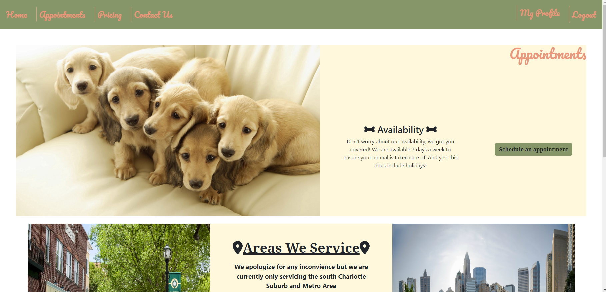

# paws-n-claws

# What is this?
- This is a production website built for a small business using the MERN stack
- I built this as a favor for a awesome friend which doubled as a requirement to obtain my web development certification from the UofM Coding Bootcamp
- The website includes almost all functionality that a product owner would want included in a production ready website
- The learning curve on this was substantial as I implented API's and many other react libraries to make this all work together.

## Installation
- No installation required as this is a production website. However if you would like to use this repository for reference, after cloning this to your local machine, run the `npm install` command at the root of the directory followed by `npm run develop` which will start the server. 

- Ensure you have node.js installed. This application is using v16.17 which is no longer available on the nodejs.org so it may require some tweaking if you are building your own website using heroku. Heroku can be finicky which is why the engine version is declared in the package.json of this directory.

- Change the mongoDB hyperlink in the connection.js file to a mongo database that you are using 

- The calendly API call uses my own token, if you would like to integrate your own api calls you will need to create your own key and .env file

## Usage
- You can use this website and book reservations with the owner at (https://pawsnclaws-petcare.herokuapp.com/)

## Credits
- The awesome instructors at the UofM Coding Bootcamp for teaching and helping me with everything necessary to build this site
- ActionBoy6(Keith) for building the footer 
